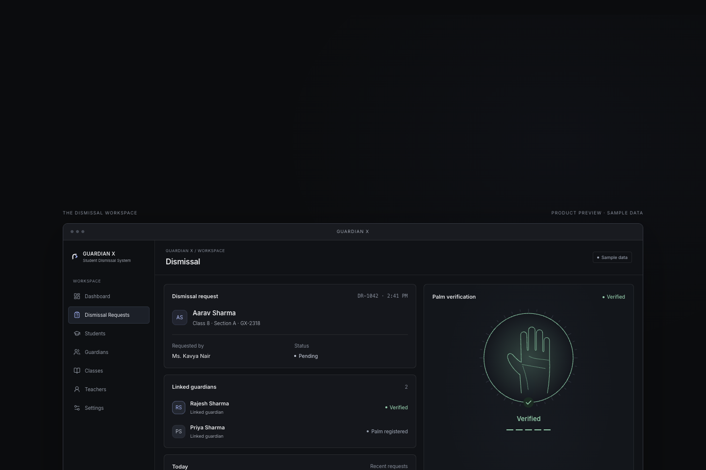
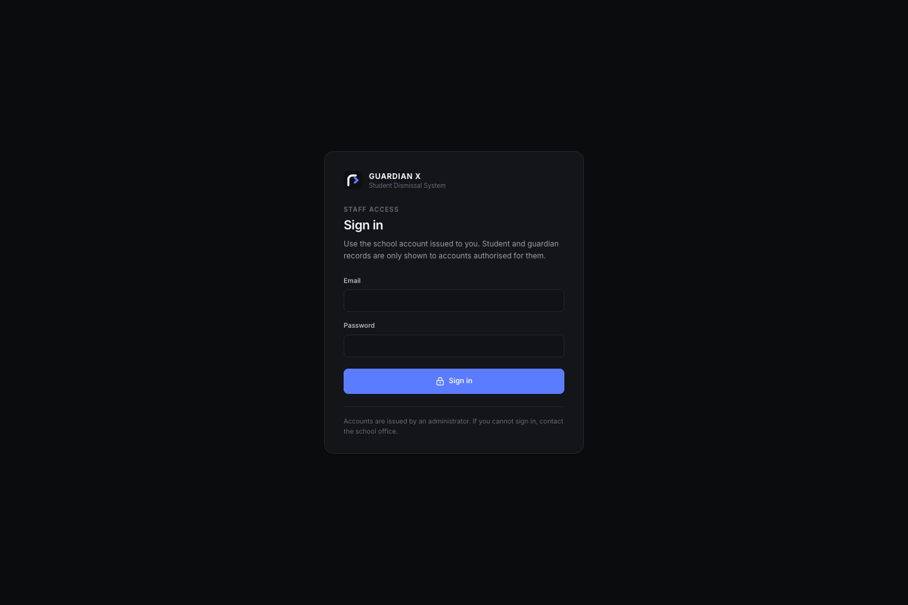
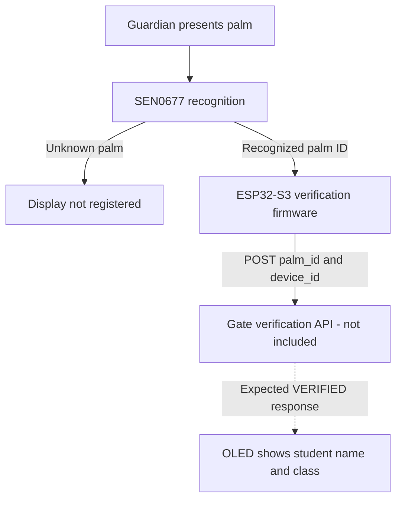
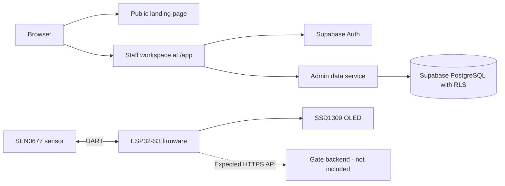

<p align="center">
  
</p>

# GUARDIAN X

**A focused guardian palm-based student dismissal system for controlled school gate workflows.**

[](package.json)
[](package.json)
[](package.json)

[Repository](https://github.com/risuhfoundry/GUARDIANX) · [Local development](#local-development) · [Device integration](#api--device-integration) · [Roadmap](#roadmap)

GUARDIAN X brings student and class records, guardian relationships, palm registration status, and dismissal requests into a focused staff workspace. Separate ESP32-S3 firmware communicates with a DFRobot SEN0677 palm-vein sensor for enrollment and verification.

## Project Status

The repository contains a **Supabase-backed, authenticated, read-only web application** and **device firmware with an unfinished backend connection**. The package version is `0.1.0`.

| Area | Current implementation |
| --- | --- |
| Staff access | Email/password sign-in, session restoration, sign-out, and profile-based access checks. |
| Records | Class, student, guardian, and teacher views; student and guardian search; student class filtering. |
| Dismissal requests | Summary counts, request list, and detail views for existing database records. |
| Editing and import | Form components exist, but add/edit/import controls are disabled and reducer write actions do nothing. |
| Guardian palms | Registration status is displayed in the web app; separate firmware handles sensor enrollment. |
| Device connection | Firmware sends verification requests; the server endpoint is not included. |
| Settings | Navigation destination with a placeholder, without configuration controls. |

The complete guardian verification → teacher decision → student dismissal workflow is **not yet connected end to end**. The public landing page uses explicitly labeled sample-data demonstrations; those animations are not live dismissal activity.

## Screenshots

<p align="center">
  
  
</p>

<p align="center"><em>Landing-page product preview with sample data · Staff sign-in</em></p>

The product preview uses the landing page's explicitly labelled sample data. The sign-in screen is the real protected application entry point.

## How GUARDIAN X Works

### Staff workspace

1. Open `/app` and sign in with an administrator-issued Supabase Auth account.
2. The application loads the account's `profiles` row. A missing or inactive profile prevents access to the workspace.
3. The data service reads permitted classes, teachers, students, guardians, relationships, and dismissal requests from Supabase.
4. Staff browse records and open dismissal details. Teachers receive data scoped to their assigned classes by database policies; administrators use the broader administration views.
5. Existing request statuses are displayed as `Pending`, `Approved`, `Rejected`, or `Completed`. There are no request-creation, approval, rejection, or completion actions in the current application.

Data loads when the workspace mounts. There is no implemented live subscription or polling loop for incoming requests.

### Guardian palm workflow in the firmware

Enrollment and verification are separate firmware images. Enrollment starts from the board's BOOT/admin button, asks the sensor to register a palm, and displays the returned identifier on the OLED and serial monitor. The firmware instructs the operator to link that identifier in Supabase; it does not perform that database update.

Verification waits for Wi-Fi, requests recognition from the sensor, and accepts palm identifiers of `1001` or greater. A recognized identifier is sent to the configured API. The following diagram describes the firmware path and marks the missing server explicitly:



The success screen also says “Dismissal Requested.” That text is a firmware display state; this repository does not implement the server operation that creates the request or decides whether a student may leave.

## Core Workflows

| Workflow | Available behavior |
| --- | --- |
| Class & student management | Browse class membership and class details, including student count. Search students by name, admission number, or linked guardian; filter by class and open student details. Creating and editing records are disabled. |
| Guardian management | Search guardians by their name or linked student's name. View linked students, classes, and palm status. Creating guardians and editing links are disabled. |
| Guardian palm management | Display `Registered` / `Not registered`. The database has an optional `palm_id`; the web data service does not fetch it. Enrollment is handled by the separate firmware, with no automatic sync to guardian records. |
| Teacher dismissal | Teachers can review permitted requests and their stored statuses. Classes and Teachers navigation entries are reserved for admin roles. No teacher decision submission is implemented. |
| Student information | Student details show name, admission number, class, linked guardians, and palm status. Request details show student, class, guardian, teacher decision derived from the stored status, current status, and request timestamp. |
| Dismissal overview | Counts for today's requests and each status, plus the five most recent requests. “Today” uses the browser's local date; status totals cover the loaded records. |

The database represents teacher assignments through `teacher_classes`. The current client model keeps only one `teacherId` per class, so its class and teacher pages do not fully represent multiple teachers assigned to the same class.

## Architecture

The web application is a client-rendered **React + TypeScript + Vite SPA**. It connects directly to Supabase Auth and the Supabase database API through `@supabase/supabase-js`.



`src/Root.tsx` separates the landing page from the authenticated application using lazy loading. Workspace navigation is React state rather than a set of server routes. The data provider mounts after authentication and is removed on sign-out.

There are no Next.js application routes, server actions, middleware, custom API handlers, or Supabase Edge Functions in this checkout. The Vercel configuration serves the static `dist/` build with an SPA fallback.

## Tech Stack

| Layer | Technology verified in the repository |
| --- | --- |
| Web UI | React 19, TypeScript 5.9, Vite 7 |
| Styling & components | Custom CSS tokens and React components, Inter Variable, Lucide icons |
| Landing-page motion | Motion for React |
| Data & authentication | Supabase JavaScript client, Supabase Auth, PostgreSQL, SQL migrations and RLS |
| Spreadsheet component | `read-excel-file` for browser-side `.xlsx` parsing; import is currently disabled |
| Web tooling | Node.js `24.x`, pnpm `11.25.0`, TypeScript checks, Node test runner via `tsx` |
| Web deployment configuration | Vercel, static Vite build |
| Firmware | C++ / Arduino, PlatformIO, Espressif ESP32-S3-DevKitC-1 |
| Device peripherals & libraries | DFRobot SEN0677, SSD1309 128×64 OLED, U8g2, ArduinoJson |

Version requirements and scripts are defined in [package.json](package.json); firmware environments are defined in [Hardware/platformio.ini](Hardware/platformio.ini).

## Project Structure

```text
GUARDIANX/
├── src/
│   ├── Root.tsx               # Public landing / staff application split
│   ├── App.tsx                # Authentication gate and workspace
│   ├── pages/                 # Login, landing, and workspace pages
│   ├── features/
│   │   ├── auth/              # Session and profile handling
│   │   ├── admin/             # Supabase reads, shared state, detail/editor dialogs
│   │   ├── students/          # Student dialogs and inactive Excel import flow
│   │   └── landing/           # Public product demonstrations with sample data
│   ├── components/            # Shared UI primitives
│   ├── data/                  # Record types and formatting helpers
│   ├── layout/                # Responsive staff application shell
│   ├── lib/                   # Supabase client, config validation, database types
│   └── styles/                # CSS tokens, application and landing styles
├── public/                    # Brand assets and route manifest
├── supabase/migrations/       # Schema extensions, seed data, and RLS changes
├── Hardware/
│   ├── platformio.ini         # Separate enroll and verify builds
│   └── src/
│       ├── enroll.cpp         # Button-driven sensor enrollment
│       └── main.cpp           # Recognition, HTTP client, and OLED feedback
├── tests/                     # Configuration/auth unit tests and live RLS probes
├── .env.example
├── package.json
├── pnpm-lock.yaml
├── vite.config.ts
├── vercel.json
├── plan.md                    # Historical frontend implementation plan
├── ideas.md                   # Design direction
├── BOM.md                     # Hardware bill of materials
├── JOURNAL.md                 # Development journal
└── README.md
```

`PRD.md`, `techstackWebpage.md`, and `architecture.md` are not present. [plan.md](plan.md) describes an earlier in-memory frontend phase; the current source and migrations take precedence over its historical implementation notes.

## Data Model

The checked-in migrations **extend an existing Supabase database**. They do not recreate its complete base schema.

| Entity | Purpose and relationships |
| --- | --- |
| `classes` | Pre-existing class records, referenced by `students.class_id` and teacher assignments. |
| `profiles` | Pre-existing staff identity and roles: `SUPER_ADMIN`, `ADMIN`, `TEACHER`. The app loads a profile using the authenticated account's ID. |
| `teacher_classes` | Pre-existing assignments linking `teacher_profile_id` to `profiles` and `class_id` to `classes`. |
| `students` | Text ID, name, unique text admission number, and nullable class UUID. Text admission numbers preserve leading zeros. |
| `guardians` | Text ID, name, constrained `palm_status`, and nullable text `palm_id`. There is no separate palm-template table. |
| `student_guardians` | Many-to-many link table with a composite primary key. A trigger checks the two-guardian limit on inserts and updates. |
| `dismissal_requests` | Student/guardian pair, optional teacher profile, request timestamp, and constrained status. A composite foreign key requires the guardian to be linked to the student. |
| `class_directory` | View of non-archived classes used by the frontend. |
| `teacher_directory` | View of active, non-archived teacher names and class assignments. |

The final migration makes both directory views `security_invoker` views, so their reads use the caller's base-table permissions. See [the schema migration](supabase/migrations/20260930120000_guardianx_schema.sql), [authenticated RLS migration](supabase/migrations/20260930120300_guardianx_auth_rls.sql), and [database types](src/lib/database.types.ts).

The seed migration contains a school roster described by its source comments as real data, not synthetic demo fixtures. It creates no dismissal requests or enrolled palms. It does not provision staff Auth accounts or teacher assignments.

## API / Device Integration

### Firmware-side contract

The device endpoint is implemented as a Supabase Edge Function, not as a route in the Vite app. The firmware must send requests to the Supabase project's function URL, e.g. `https://<project-ref>.supabase.co/functions/v1/hardware-dismissal`.

Configure `API_BASE_URL` in the firmware to that full function URL. The device authenticates with an API key issued from **Hardware / API** in the staff workspace.

The firmware sends:

```http
POST /functions/v1/hardware-dismissal
Content-Type: application/json
Authorization: Bearer <device-api-key>

{"student_id":"...","guardian_id":"...","palm_id":"...","device_id":"GATE_01"}
```

The device key comes from `GUARDIANX_DEVICE_API_KEY`, which PlatformIO injects as the C++ `DEVICE_API_KEY` macro. An empty key stops the request locally.

A successful verification response looks like:

```json
{
  "verified": true,
  "request_id": "...",
  "dismissed_at": "...",
  "student": {"id":"...","name":"...","admission_number":"..."},
  "guardian": {"id":"...","name":"..."},
  "class": {"id":"...","name":"...","section":"..."}
}
```

Failure responses include:

```json
{"verified": false, "reason": "Palm identifier does not match the registered palm."}
```

The Edge Function validates the API key, checks that the guardian palm is registered and matches the presented `palm_id`, confirms the guardian is linked to the student, looks up the student's class, and creates a `dismissal_requests` row with status `Completed`. Admin API keys are managed through the separate `hardware-api-keys` Edge Function.

### Firmware setup

Use PlatformIO with the board and peripherals defined in [Hardware/platformio.ini](Hardware/platformio.ini) and [BOM.md](BOM.md). Both firmware environments use a serial monitor speed of `115200`.

Before verification use, configure `WIFI_SSID`, `WIFI_PASSWORD`, `API_BASE_URL`, and `DEVICE_ID` in the firmware. These are C++ definitions, not web environment variables. The current source contains inline Wi-Fi credentials; keep replacement credentials out of commits.

Resolve the duplicate sensor pin definitions in `main.cpp` before wiring or uploading: it defines RX/TX as both `16/17` and `4/5`. Enrollment uses `4/5`. Both images use OLED SCK `12`, MOSI `11`, CS `10`, DC `9`, and reset `8`; enrollment uses the BOOT button on GPIO `0`.

Build from the hardware directory:

```bash
cd Hardware
pio run -e enroll
export GUARDIANX_DEVICE_API_KEY='<device-api-key>'
pio run -e verify
```

With the intended board connected, append `-t upload` to the chosen build command. Enrollment and verification replace one another on that board; they are not simultaneous modes. Firmware behavior is described from source, without a claim of completed hardware validation.

## Local Development

### Prerequisites

- Node.js `24.x` and pnpm `11.25.0` as declared in `package.json`. The deployment commands invoke pnpm through Corepack.
- A compatible Supabase project and a provisioned staff account for the protected workspace.
- PlatformIO and physical hardware only if working on the firmware.

### Install and configure the web app

```bash
git clone https://github.com/risuhfoundry/GUARDIANX.git
cd GUARDIANX
corepack pnpm install --frozen-lockfile
cp .env.example .env.local
```

Fill in the two public Supabase values in `.env.local` before starting the application.

### Supabase prerequisites and migrations

**A fresh Supabase project cannot be initialized from these migrations alone.** The repository assumes `classes`, `profiles`, `teacher_classes`, the `user_role` enum, and the functions `current_role()`, `is_admin()`, and `teacher_assigned_class_ids()` already exist, together with their grants and policies. Their creation migrations and an account-provisioning script are missing. Obtain the compatible base schema before attempting a new database setup.

For a compatible database where these migrations have not already been applied, use the project's database administration process to apply the SQL files in timestamp order:

| Order | Migration | Purpose |
| --- | --- | --- |
| 1 | `20260930120000_guardianx_schema.sql` | Student, guardian, relationship, and dismissal tables. |
| 2 | `20260930120100_guardianx_rls.sql` | Initial RLS and directory views, including temporary anonymous reads. |
| 3 | `20260930120200_guardianx_seed_tulip_data.sql` | School roster seed; review its data before use. |
| 4 | `20260930120300_guardianx_auth_rls.sql` | Removes anonymous access and introduces authenticated, role-scoped reads. |

Complete the final authentication migration before exposing the database to the web app. The scripts are not a general-purpose repeatable reset: do not rerun already-applied migrations. There is no checked-in Supabase CLI configuration or automated local database bootstrap.

Create staff Auth accounts through the Supabase Dashboard, as described in the login implementation, and ensure each has a matching active `profiles` row with the appropriate role. Teachers also need `teacher_classes` assignments. The web app has no signup or account-provisioning UI.

### Run

```bash
corepack pnpm dev
```

Open [the landing page](http://localhost:3000) or [the staff workspace](http://localhost:3000/app). Vite uses port `3000` with `strictPort`; it will not silently choose a different port.

### Available checks

| Command | Purpose |
| --- | --- |
| `corepack pnpm check` | TypeScript project checks. |
| `corepack pnpm test:unit` | Supabase configuration and auth-error unit tests. |
| `corepack pnpm build` | TypeScript checks and production output in `dist/`; requires valid public Supabase configuration. |
| `corepack pnpm preview` | Serve an existing production build locally. |
| `corepack pnpm test:anon` | Live Supabase access probes, plus authenticated checks when test credentials are supplied. |
| `corepack pnpm test` | Live probes followed by the bundle scan; build first. |

Use a dedicated test database for live probes: they attempt writes to verify denial and include seed-specific assertions. Authenticated checks without credentials report `SKIP`, not a pass. The bundle scanner rejects JWT-shaped strings, including legacy anon JWTs accepted by the app; use a publishable key for that check. The optional deactivation probe can leave its test account disabled.

## Environment Variables

Copy [`.env.example`](.env.example) to the ignored `.env.local` file. Replace these placeholders with your project's public configuration:

```dotenv
VITE_SUPABASE_URL=https://your-project-ref.supabase.co
VITE_SUPABASE_ANON_KEY=your-supabase-publishable-or-anon-key
```

| Variable | Used by | Requirement |
| --- | --- | --- |
| `VITE_SUPABASE_URL` | Vite build and browser | Required project URL; HTTPS, or HTTP for a local Supabase host. |
| `VITE_SUPABASE_ANON_KEY` | Vite build and browser | Required publishable key or legacy `anon` JWT. |
| `GUARDIANX_TEST_ADMIN_EMAIL` / `GUARDIANX_TEST_ADMIN_PASSWORD` | Live tests | Optional administrator test credentials. |
| `GUARDIANX_TEST_TEACHER_EMAIL` / `GUARDIANX_TEST_TEACHER_PASSWORD` | Live tests | Optional teacher test credentials. |
| `GUARDIANX_TEST_ALLOW_DEACTIVATION` | Live tests | Optional destructive probe when set to `1`; leave unset for normal checks. |
| `GUARDIANX_DEVICE_API_KEY` | PlatformIO verification build | Injected into the device firmware; never put it in a `VITE_` variable. |

`VITE_` values are bundled into browser JavaScript. Never supply a Supabase service-role or secret key. The shared configuration validator rejects recognized privileged key formats, malformed URLs, and missing values; a production build fails when this validation fails. Rebuild after changing deployed public configuration.

## Deployment

[vercel.json](vercel.json) configures Vercel for Vite with:

- Install: `corepack pnpm install --frozen-lockfile`
- Build: `corepack pnpm build`
- Output: `dist`
- Rewrite: all application paths to `/index.html`

1. Connect [risuhfoundry/GUARDIANX](https://github.com/risuhfoundry/GUARDIANX) to a Vercel project using Node.js `24.x`.
2. Configure `VITE_SUPABASE_URL` and `VITE_SUPABASE_ANON_KEY` for the deployment environment.
3. Confirm the compatible Supabase schema, final RLS migration, and staff profiles are in place, then deploy the static build.
4. Check `/`, direct navigation to `/app`, sign-in, session restoration, and sign-out.
5. Verify that permitted records and existing dismissal request details load, and that teacher access remains limited to assigned classes.

This configuration does not deploy a gate API. Full hardware-to-dismissal verification remains blocked on that missing backend and the unfinished teacher actions; the repository does not establish production readiness.

## Security

- **Authentication:** Supabase Auth handles email/password sign-in. The application checks the stored staff profile before mounting the data provider and removes workspace state on sign-out.
- **Authorization:** The final migration revokes anonymous application-table/view access. Read policies use admin and assigned-class helpers from the existing database. These helper implementations and the base-table policies must be supplied by the compatible base schema.
- **Writes and validation:** The four new application tables expose no authenticated write policies. SQL constrains statuses, admission-number uniqueness, and guardian–student references; a trigger checks the guardian count. Browser controls are not the authorization boundary.
- **Palm data:** The firmware requests enrollment and matching from the sensor. The application schema stores a palm identifier and registration status, with no raw biometric-template column or custom recognition algorithm. The web service omits `palm_id` from its query; that omission is not a column-level access restriction for otherwise authorized database clients.
- **Device limitations:** Verification sends an API key, but the server validator is absent. The HTTPS client currently calls `setInsecure()`, disabling certificate verification; replacing it with `setCACert()` is an explicit source TODO. Inline Wi-Fi credentials and serial logging of verification responses also need review before operational use.

No biometric accuracy, certification, or security guarantee is established by this repository.

## Design Philosophy

The interface uses a clean, dark, minimal visual language: Inter typography, muted surfaces, quiet borders, restrained blue accents, and clear status labels. The staff shell has a collapsible sidebar and mobile navigation; dialogs and controls include keyboard-focus behavior. The public landing page adds product demonstrations and motion with reduced-motion handling.

The design stays focused on students, guardians, and the dismissal workflow. [ideas.md](ideas.md) records the original design direction.

## Roadmap

These items reflect existing implementation boundaries and source plans, without a release schedule.

| State | Scope and source |
| --- | --- |
| Implemented | Authenticated directory and dismissal-history reads, role-scoped policies, and the public product demonstration. |
| In progress — partial implementation | Class, student, guardian, and Excel-import forms from [plan.md](plan.md) remain in the tree, but persistence and write authorization are not connected. |
| In progress — partial implementation | Enrollment and verification firmware exist; automatic guardian palm linking, the gate endpoint, and actionable teacher dismissal remain unconnected. See [enrollment firmware](Hardware/src/enroll.cpp), [verification firmware](Hardware/src/main.cpp), and the [illustrative workflow](src/features/landing/WorkflowDemo.tsx). |
| Planned — explicit TODO | Replace the firmware's insecure TLS configuration with CA certificate verification. |

Settings is intentionally a placeholder; its presence in navigation does not imply a planned configuration module.

## Contributing

Keep changes focused on the dismissal workflow and distinguish working behavior from demonstrations. For web changes, run `corepack pnpm check`, `corepack pnpm test:unit`, and `corepack pnpm build`. Run live access tests only against a suitable test database. Describe any schema, access-policy, or firmware-contract changes in the pull request and update this README when behavior changes.

## License

No project license has currently been specified. License files for bundled third-party hardware dependencies apply to those dependencies, not to GUARDIAN X as a whole.

## Project

Maintained in [risuhfoundry/GUARDIANX](https://github.com/risuhfoundry/GUARDIANX). See the [development journal](JOURNAL.md) and [bill of materials](BOM.md) for the repository's hardware progress and parts list.
